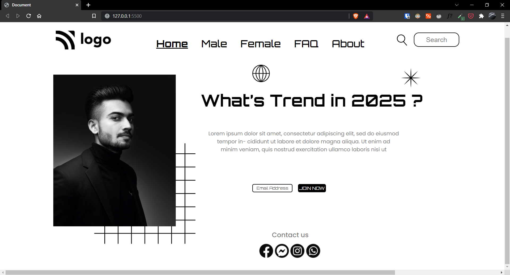

# Project-01 | Porfolio Web Page

Hi there,
I'm Wasit Ali and this is my 1st project on HTML and CSS.

## 🖥 Preview

`note:` please make sure the preview screen is `1920 x 1080` and the web site is not responsive.

🚀 [Live Preview](https://live-class-project-01-rho.vercel.app/)

## 🛠️ What I have learned in this project?

- Basic CSS selectors and their properties.
- Clear understanding of CSS positioning property.
- Basic of z-index css property.

## ⏲ Time taken to finish the project

- It took me one and half day to complete this project.
